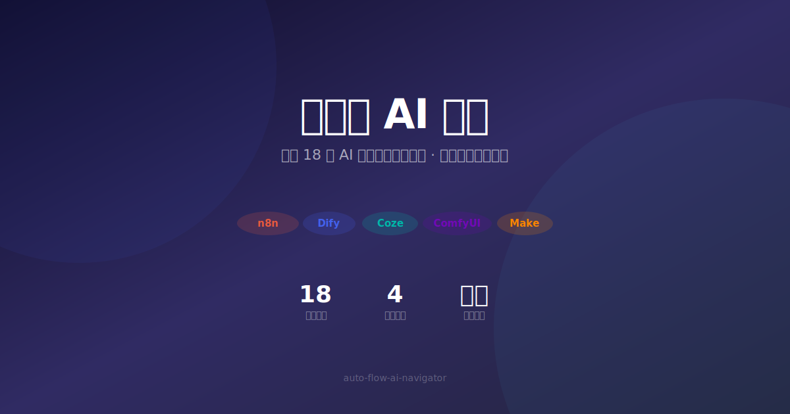

 

   
 

 
 <h2 align="center">自动流 AI 导航 · Auto-Flow AI Navigator</h2>
 
 

   精选全球最热门的 18 款 AI 自动化工作流工具，分类对比核心能力与市场口碑，帮你快速找到最适合的自动流方案。
    
   在线体验：<a href="https://yuan-6b58.github.io/auto-flow-ai-navigator/" target="_blank"><strong>yuan-6b58.github.io/auto-flow-ai-navigator</strong></a>
 

 
 

   <a href="https://yuan-6b58.github.io/auto-flow-ai-navigator/" target="_blank">🌐 访问网站</a>
   ·
   <a href="https://github.com/Yuan-6B58/auto-flow-ai-navigator/issues">📮 提交建议</a>
   ·
   <a href="https://github.com/Yuan-6B58/auto-flow-ai-navigator/issues">🐛 反馈问题</a>
 

 
 ---
 
 ## 标签说明
 
 | 标签 | 说明 |
 |------|------|
 | 🆕 | 最近更新 |
 | ⭐ | 推荐工具 |
 | 🐙 开源 | 开源项目，可自托管 |
 | ☁️ SaaS | 云服务平台 |
 | 🔀 混合 | 开源 + 云服务 |
 
 ---
 
 ## 🏆 最热门 TOP 5
 
 <table>
   <tr>
     <th>#</th>
     <th>工具</th>
     <th>简介</th>
     <th>评价</th>
     <th>链接</th>
   </tr>
   <tr>
     <td><strong>1</strong></td>
     <td><strong>n8n</strong> 🐙</td>
     <td>开源自动化工作流引擎，400+ 集成节点，自托管部署，灵活度极高</td>
     <td>⭐ 4.9 · 44k+ GitHub ⭐</td>
     <td><a href="https://n8n.io" target="_blank">🔗</a></td>
   </tr>
   <tr>
     <td><strong>2</strong></td>
     <td><strong>Dify</strong> 🐙</td>
     <td>开源 LLMOps 平台，一站式构建 RAG、Agent、工作流应用，国产标杆</td>
     <td>⭐ 4.8 · 52k+ GitHub ⭐</td>
     <td><a href="https://dify.ai" target="_blank">🔗</a></td>
   </tr>
   <tr>
     <td><strong>3</strong></td>
     <td><strong>Coze（扣子）</strong> ☁️</td>
     <td>字节跳动出品的 AI Bot 构建平台，丰富的插件生态和知识库能力</td>
     <td>⭐ 4.7 · 百万级用户</td>
     <td><a href="https://www.coze.com" target="_blank">🔗</a></td>
   </tr>
   <tr>
     <td><strong>4</strong></td>
     <td><strong>ComfyUI</strong> 🐙</td>
     <td>节点式 Stable Diffusion 工作流引擎，图像生成领域的标配</td>
     <td>⭐ 4.8 · 55k+ GitHub ⭐</td>
     <td><a href="https://github.com/comfyanonymous/ComfyUI" target="_blank">🔗</a></td>
   </tr>
   <tr>
     <td><strong>5</strong></td>
     <td><strong>Make</strong> ☁️</td>
     <td>可视化自动化平台（原 Integromat），直观的拖拽编辑器，适合企业级场景</td>
     <td>⭐ 4.4 · 企业级用户</td>
     <td><a href="https://www.make.com" target="_blank">🔗</a></td>
   </tr>
 </table>
 
 ---
 
 ## ⚙ 自动化工作流平台
 
 通用型自动化工具，覆盖 HTTP、数据库、消息通知等场景。
 
 <table>
   <tr>
     <th>#</th>
     <th>工具</th>
     <th>核心能力</th>
     <th>评价</th>
     <th>链接</th>
   </tr>
   <tr><td>1</td><td><strong>n8n</strong> 🐙</td><td>通用自动化 · 自托管 · 400+ 集成</td><td>⭐ 4.9 — 开源社区活跃，企业自托管首选</td><td><a href="https://n8n.io">🔗</a></td></tr>
   <tr><td>2</td><td><strong>Make</strong> ☁️</td><td>无代码 · 可视化 · 企业级</td><td>⭐ 4.4 — 比 Zapier 灵活，性价比高</td><td><a href="https://www.make.com">🔗</a></td></tr>
   <tr><td>3</td><td><strong>Zapier</strong> ☁️</td><td>极简操作 · 无代码 · 6000+ 集成</td><td>⭐ 4.3 — 生态最大，高阶功能付费较贵</td><td><a href="https://zapier.com">🔗</a></td></tr>
   <tr><td>4</td><td><strong>Activepieces</strong> 🐙</td><td>开源替代 · TypeScript · 自托管</td><td>⭐ 4.2 — 新兴开源方案，社区快速增长</td><td><a href="https://www.activepieces.com">🔗</a></td></tr>
   <tr><td>5</td><td><strong>Node-RED</strong> 🐙</td><td>IoT · 可视化编程 · Node.js</td><td>⭐ 4.1 — IoT 领域标准，AI 集成需自行扩展</td><td><a href="https://nodered.org">🔗</a></td></tr>
 </table>
 
 ## 🤖 AI 应用开发平台
 
 专注于 LLM 应用构建，集成 RAG、Agent、工作流编排。
 
 <table>
   <tr>
     <th>#</th>
     <th>工具</th>
     <th>核心能力</th>
     <th>评价</th>
     <th>链接</th>
   </tr>
   <tr><td>1</td><td><strong>Dify</strong> 🐙</td><td>LLMOps · RAG · Agent · 私有化</td><td>⭐ 4.8 — 52k+ ⭐，企业级 RAG 首选</td><td><a href="https://dify.ai">🔗</a></td></tr>
   <tr><td>2</td><td><strong>Coze（扣子）</strong> ☁️</td><td>Bot 构建 · 插件生态 · 多渠道</td><td>⭐ 4.7 — 国内 Bot 开发首选，上手极快</td><td><a href="https://www.coze.com">🔗</a></td></tr>
   <tr><td>3</td><td><strong>Flowise</strong> 🐙</td><td>低代码 · RAG · 拖拽搭建</td><td>⭐ 4.3 — 入门门槛低，适合快速原型验证</td><td><a href="https://flowiseai.com">🔗</a></td></tr>
   <tr><td>4</td><td><strong>FastGPT</strong> 🐙</td><td>知识库 · 问答 · 工作流</td><td>⭐ 4.2 — 知识库场景体验优秀，商业友好</td><td><a href="https://fastgpt.in">🔗</a></td></tr>
 </table>
 
 ## 🧠 AI Agent 框架
 
 多 Agent 协作、自主任务分解、有状态编排。
 
 <table>
   <tr>
     <th>#</th>
     <th>工具</th>
     <th>核心能力</th>
     <th>评价</th>
     <th>链接</th>
   </tr>
   <tr><td>1</td><td><strong>AutoGPT</strong> 🐙</td><td>自主 Agent · 任务分解 · 长期记忆</td><td>⭐ 4.3 — 开创性项目，实测稳定性有待提升</td><td><a href="https://github.com/Significant-Gravitas/AutoGPT">🔗</a></td></tr>
   <tr><td>2</td><td><strong>CrewAI</strong> 🐙</td><td>多 Agent · 角色协作 · 任务编排</td><td>⭐ 4.6 — 多 Agent 场景的 Python 首选框架</td><td><a href="https://www.crewai.com">🔗</a></td></tr>
   <tr><td>3</td><td><strong>LangGraph</strong> 🐙</td><td>有状态 · 图编排 · LangChain 生态</td><td>⭐ 4.7 — 社区活跃，深度集成 LangChain</td><td><a href="https://langchain-ai.github.io/langgraph">🔗</a></td></tr>
   <tr><td>4</td><td><strong>MetaGPT</strong> 🐙</td><td>软件开发 · 多角色 · 模拟协作</td><td>⭐ 4.2 — 角色模拟思路出色，产出取决于模型</td><td><a href="https://github.com/geekan/MetaGPT">🔗</a></td></tr>
   <tr><td>5</td><td><strong>Dify Agent</strong> 🔀</td><td>ReAct · Function Call · Dify 生态</td><td>⭐ 4.5 — 与 Dify RAG 工作流配合极佳</td><td><a href="https://dify.ai">🔗</a></td></tr>
 </table>
 
 ## 🔀 AI 模型工作流
 
 图像生成、LLM 编排、MLOps 等专业工作流工具。
 
 <table>
   <tr>
     <th>#</th>
     <th>工具</th>
     <th>核心能力</th>
     <th>评价</th>
     <th>链接</th>
   </tr>
   <tr><td>1</td><td><strong>ComfyUI</strong> 🐙</td><td>图像生成 · 节点式 · SD 生态</td><td>⭐ 4.8 — 图像生成领域不可替代的标杆</td><td><a href="https://github.com/comfyanonymous/ComfyUI">🔗</a></td></tr>
   <tr><td>2</td><td><strong>LangFlow</strong> 🐙</td><td>LangChain 可视化 · 拖拽 · 代码导出</td><td>⭐ 4.1 — 适合 LangChain 初学者理解工作流</td><td><a href="https://www.langflow.org">🔗</a></td></tr>
   <tr><td>3</td><td><strong>PromptFlow</strong> 🐙</td><td>Azure 集成 · 评估 · 企业级</td><td>⭐ 4.3 — 微软生态首选，企业级 LLM 开发</td><td><a href="https://promptflow.io">🔗</a></td></tr>
   <tr><td>4</td><td><strong>Airflow (AI)</strong> 🐙</td><td>MLOps · DAG 编排 · 调度</td><td>⭐ 4.0 — 传统数据编排扩展，适合 ML 基础设施</td><td><a href="https://airflow.apache.org">🔗</a></td></tr>
 </table>
 
 ---
 
 

   <a href="https://yuan-6b58.github.io/auto-flow-ai-navigator/" target="_blank"><strong>🌐 在线体验完整网站</strong></a>
   &nbsp;&nbsp;·&nbsp;&nbsp;
   <a href="https://github.com/Yuan-6B58/auto-flow-ai-navigator">📦 GitHub 仓库</a>
   &nbsp;&nbsp;·&nbsp;&nbsp;
   <a href="https://github.com/Yuan-6B58/auto-flow-ai-navigator/blob/main/index.html">📄 源码</a>
 

 
 

   数据截至 2026-06-13 · 持续更新中
 

